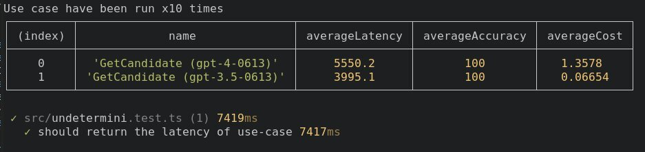

<div align="center">
  <br/>
  
  <br/>
  <br/>
</div>

This library is to be able to make decision on wich LLM implementation is the best suited for a 
given use case.

<div align="center">
  <br/>
  
  <br/>
  <br/>
</div>


## Table of Contents

- [Installation](#installation)
- [Usage](#usage)
- [API](#api)
- [Tutorial](#tutorial)
- [Testing](#testing)

## Installation

### Npm

```bash
npm install undetermini --save
```

### Yarn

```bash
yarn add undetermini 
```

## Usage

TODO

```typescript
TODO
```


## API

Full References - [here](https://sraleik.github.io/undetermini/)

## Tutorial

<!-- [Create a Command](https://sraleik.github.io/undetermini/pages/tutorial/create-a-command.html) -->

## Testing

## Contributions

Feel free to start/join a discussion, issues or Pull requests.

## TODO

### Feature

- [X] use https://www.npmjs.com/package/console-table-printer for display 
- [ ] allow to choose how to sort on Presenter 
- [ ] calculate average Error 
- [X] improve price calculation (do not use float) 
- [ ] display who si cheapest and by how much 
- [ ] display who is most accurate and by how much 
- [ ] display who is fastest and by how much 
- [ ] give accuracy fonction as a parameter 
- [ ] add the price of the complete undetermini.run  
- [X] add cache on implementation 
- [X] add possibility to deactivate methodImplementation 
- [X] allow to add LLM Model Info 
- [X] remove price calculation from Undetermini class


### Documentation

### Technical
