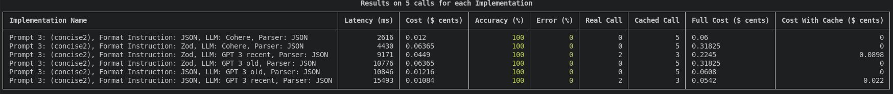

<div align="center">
  <br/>
  
  <br/>
  <br/>
</div>

This library is to be able to make decision on wich LLM implementation is the best suited for a 
given use case.

<div align="center">
  <br/>
  
  <br/>
  <br/>
</div>


## Table of Contents

- [Installation](#installation)
- [Usage](#usage)
- [API](#api)
- [Tutorial](#tutorial)
- [Testing](#testing)

## Installation

### Npm

```bash
npm install undetermini --save
```

### Yarn

```bash
yarn add undetermini 
```

## Usage

### Simplest use : 

```typescript
import { Undetermini, UsecaseImplementation } from "undetermini";

const undetermini = await Undetermini.create({ persistOnDisk: true });
// Create an undetermini instance, persistOnDisk is false by default
// When enable it will create a undetermini-db.json where result are store 
// Enable it if you want cache

const useCaseInput = { x: 2, y: 10 };

// "UsecaseImplementation" is a wrapper that allow undetermini to do some magik
// "execute" is the function you want to compare to another one
// do not use an arrow function or you wont be able to calculate cost
const implementation1 = UsecaseImplementation.create({
  name: "xTimeY",
  execute: function (payload: { x: number; y: number }) {
    const { x, y } = payload;
    return x * y;
  }
});

// let's assume this implementation cost money
// add callId as the 2nd parameter
// and use this.addCost(value, callId) to add the cost of this call
const implementation2 = UsecaseImplementation.create({
  name: "yTimeX",
  execute: function (payload: { x: number; y: number }, callId: string) {
    const { x, y } = payload;

    //Cost are in cents 
    this.addCost(1, callId)
    return y * x;
  }
});

const res = undetermini.run({
  useCaseInput,
  implementations: [implementation1, implementation2],
  expectedUseCaseOutput: 20 // this is to calculate accuracy 
  // if 'expectedUseCaseOutput' is a primitive its either 100% or 0%
});

/* res 
[
  {
    name: 'xTimeY',
    averageCost: 0,
    averageLatency: 0,
    averageAccuracy: 100,
    averageError: 0,
    realCallCount: 1,
    callFromCacheCount: 0,
    resultsFullPrice: 0,
    resultsCurrentPrice: 0
  },
  {
    name: 'yTimeX',
    averageCost: 1,
    averageLatency: 0,
    averageAccuracy: 100,
    averageError: 0,
    realCallCount: 1,
    callFromCacheCount: 0,
    resultsFullPrice: 0,
    resultsCurrentPrice: 0
  }
]
*/
```

### Expected output is an object 

```typescript
const res = undetermini.run({
  useCaseInput,
  implementations: [getCandidate1, getCandidate2],
  expectedUseCaseOutput: { firstname: 'john', lastname: 'wick' },
  // if 'expectedUseCaseOutput' is an object undetermini check each key and 
  // determine a percentage of accuracy 
});
```

### Run multiple time

```typescript
const res = undetermini.run({
  useCaseInput,
  implementations: [implementation1, implementation2],
  expectedUseCaseOutput: 20,
  times: 20 // this will run implementation1 & implementation2 20 time each
});
```
### Use cache

```typescript
const res = undetermini.run({
  useCaseInput,
  implementations: [implementation1, implementation2],
  expectedUseCaseOutput: 20,
  times: 20, 
  useCache: true // false by default
  // Usefull only if persistedOnDisk is true
  // When enable it will for each implementation try to use previous run
  // If the implementation has change it will rerun the function for real
});
```

### Custom Accuracy Calculation 

```typescript
const res = undetermini.run({
  useCaseInput,
  implementations: [implementation1, implementation2],
  times: 20, 
  // if you don't want an exact match you can give you own way of computing accuracy 
	evaluateAccuracy(output) {
		return output > 20 ? 100 : 0	
	},
});
```

### Presenter 

Will display a table with results

```typescript
const res = undetermini.run({
  useCaseInput,
  implementations: [implementation1, implementation2],
  times: 20, 
  // if you don't want an exact match you can give you own way of computing accuracy 
	evaluateAccuracy(output) {
		return output > 20 ? 100 : 0	
	},
  presenter: {
    isActive: true, // Enable the presenter, (default: false)
    options: {
      sortPriority: ["latency"] // (default: ["accuracy","latency","cost","error"])
      hideColumns: ["Cost"] // (default: none)
    }
  }
});
```


## API

Full References - [here](https://sraleik.github.io/undetermini/)

## Tutorial

TODO

<!-- [Create a Command](https://sraleik.github.io/undetermini/pages/tutorial/create-a-command.html) -->


## Contributions

Feel free to start/join a discussion, issues or Pull requests.

## TODO


- [ ] Add a progress bar in presenter
- [ ] Handle persistence in usecase-implementation (will fix the cost issue)
- [ ] turn llm-info into a service-info
- [ ] better handling of rate limit
- [ ] retrieve all type and put them in their proper places 
- [ ] display who si cheapest and by how much 
- [ ] display who is most accurate and by how much 
- [ ] display who is fastest and by how much 
- [X] give accuracy fonction as a parameter 
- [X] show number of real call to UseCase
- [X] display cost of run
  - [X] with cache
  - [X] without cache
- [X] calculate average Error 
- [X] allow to choose how to sort on Presenter 
- [X] use https://www.npmjs.com/package/console-table-printer for display 
- [X] improve price calculation (do not use float) 
- [X] add cache on implementation 
- [X] add possibility to deactivate methodImplementation 
- [X] allow to add LLM Model Info 
- [X] remove price calculation from Undetermini class
