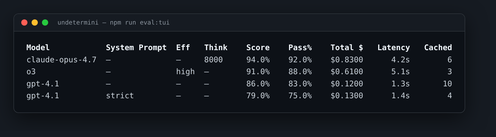

# undetermini

An eval harness for **non-deterministic code** — the kind whose output you
can't assert with `===` because it comes from an LLM (sampling, ranking,
classification, extraction…).

<p align="center">
  
  <br/>
  <em>The <code>npm run eval:tui</code> results grid: variants (model × system-prompt × reasoning) ranked by score, with cost, latency and cache hits.</em>
</p>

You define a **subject** (the code under test), declare **variants**
(provider × model × reasoning), run them across **cases** for **N trials
each**, and score every trial with **weighted assertions**. Results persist to
SQLite so you can diff runs and catch statistical regressions when you swap a
model or edit a prompt.

> This is generation 2. It grew inside a production codebase (a talent-search
> NL filter) and was extracted here to stand on its own. The original library
> (`Undetermini` / `UsecaseImplementation`) is preserved under [`legacy/`](./legacy).

---

## Unit test vs eval

|                          | **Unit test**        | **Eval**                                            |
| ------------------------ | -------------------- | --------------------------------------------------- |
| Input → output           | deterministic        | **non-deterministic** (LLM, sampling, ranking…)     |
| Pass criterion           | binary (`=== expected`) | **distribution** (pass-rate over N trials, threshold) |
| Catches                  | logic bugs           | **statistical regressions** (model swap, prompt drift) |

A unit test asks *"does this function compute X correctly?"*. An eval asks
*"does this LLM-driven feature behave correctly **most of the time**?"*.

---

## Requirements

- **Node ≥ 22** (native `better-sqlite3`).
- An `.env` with the provider keys you intend to run, e.g. `OPENAI_API_KEY`
  (and `ANTHROPIC_API_KEY` for Anthropic variants). Only needed for real runs —
  the test suite and typecheck need nothing.

---

## Use it in your project

```bash
npm install undetermini
```

Declare what you want to evaluate in an `undetermini.config.ts` at the root of
your project. The binaries find it by walking up from wherever you run them, the
way vitest finds `vitest.config.ts`:

```ts
// undetermini.config.ts
import { defineConfig } from 'undetermini';
import { mySubject } from './eval/my-subject';

export default defineConfig({
  subjects: {
    'my-subject': {
      subject: mySubject,
      evalFile: 'eval/my-subject.ts',
      casesDir: 'eval/cases',
      promptsDir: 'eval/prompts',
      prompts: [],
      schemas: [],
    },
  },
  defaultSubject: 'my-subject',
});
```

That is all the wiring there is. Two commands ship with the package:

| Command                    | What it does                                              |
| -------------------------- | --------------------------------------------------------- |
| `undetermini`              | Run the eval from the command line.                        |
| `undetermini-tui`          | Same runs, interactive: pick axes, watch trials live.      |

```bash
npx undetermini --subject=my-subject --case-slugs=some-case --trial-count=5
npx undetermini --config ./path/to/undetermini.config.ts   # bypass discovery
```

Run either one with no config in sight and it tells you how to write one — it
will not start billed trials on its own. To watch the harness work on its
built-in subject, ask for it: `npx undetermini --subject=example` (that one
calls a real model).

Both binaries read the `.env` sitting at your project root, after moving there.
**Importing the library does not**: if you write your own entry point that calls
the runners, loading the environment is yours to do.

### Calling it from your own code

```ts
import { EvalEngine, openEvalDb } from 'undetermini';          // the engine
import { runEvalCli, runEvalTui } from 'undetermini/clients';  // the two clients
```

The clients live at `undetermini/clients` and that subpath is ESM-only — the TUI
depends on `ink`, whose top-level await cannot be `require`d. The main entry
point works in both ESM and CommonJS.

---

## Working in this repo

```bash
npm install
```

## Commands

| Command                | What it does                                                        |
| ---------------------- | ------------------------------------------------------------------- |
| `npm run eval`         | Run the CLI harness (default subject: `example`).                   |
| `npm run eval:tui`     | Interactive Ink TUI — pick axes, watch trials, sort/aggregate live. |
| `npm run rescore`      | Retroactively re-score stored trials against the current cases.     |
| `npm test`             | `vitest` unit suite (157 tests, no network).                        |
| `npm run typecheck`    | `tsc --noEmit`.                                                     |
| `npm run build:docs`   | Generate API docs into `./docs` via typedoc.                        |

Pick a subject and narrow cases:

```bash
npm run eval -- --subject=example --case-slugs=clearly-positive --trials=5
```

## Layout

```
src/
├── index.ts                  ← public API barrel (typedoc entry point)
├── engine/                   ← the generic harness — never imports a subject
│   ├── api.ts                  EvalEngine (event-emitting run driver)
│   ├── runner-loop.ts          cases × variants × trials (p-limit)
│   ├── variant.ts              EvalVariant (provider × model × reasoning)
│   ├── scorers.ts              weighted caseAssertionsScorer
│   ├── axes/                   cartesian variant expansion + capability matrix
│   ├── cache/                  trial-aware LLM cache (SQLite-backed)
│   ├── storage/                schema, writers, fingerprint
│   ├── rescore/                retroactive rescore
│   ├── pricing.ts              $/1M-token table
│   └── telemetry-middleware.ts token + latency capture
├── config.ts                 ← undetermini.config.ts discovery + defineConfig
├── clients/
│   ├── index.ts                `undetermini/clients` — the two runners
│   ├── cli/                    `undetermini` binary, console printer
│   └── tui/                    `undetermini-tui` binary (pages, store, prefs)
├── subjects/
│   ├── registry.ts            the registry contract + the reference registry
│   └── example-sentiment/     reference subject (inline cases, no I/O)
└── shared/                    cross-cutting types
```

Design notes live at the repo root: [`VARIANT-AXES-DESIGN.md`](./VARIANT-AXES-DESIGN.md),
[`INTERACTIVE-VARIANT-DESIGN.md`](./INTERACTIVE-VARIANT-DESIGN.md),
[`LLM-CALL-OPTIMIZATION-DESIGN.md`](./LLM-CALL-OPTIMIZATION-DESIGN.md),
[`SCORER-ASYMMETRY-DESIGN.md`](./SCORER-ASYMMETRY-DESIGN.md),
[`PRICING.md`](./PRICING.md), [`ONBOARDING.md`](./ONBOARDING.md).

---

## Adding a subject

A subject is anything implementing the `Subject` contract (`src/engine/runner-loop.ts`):
`name`, `cases`, `variants`, `runOne`, `parse`. See
[`src/subjects/example-sentiment`](./src/subjects/example-sentiment) for a
complete, dependency-free reference.

Then register it — one entry in your `undetermini.config.ts`, no runner edits:

```ts
export default defineConfig({
  subjects: {
    'my-thing': { subject: myThingSubject, evalFile, casesDir, promptsDir },
  },
  defaultSubject: 'my-thing',
});
```

The registry is the composition root and it belongs to **your** project, not to
the harness: naming concrete subjects is the one thing a generic eval library
cannot do for you. Runners resolve through `resolveIn(registry, name)`, so a new
use case never touches the CLI, the TUI, or the engine.

---

## Concepts

- **Subject** — the code under test + its cases + its variants.
- **Variant** (`EvalVariant`) — one LLM configuration: provider (`openai` /
  `anthropic`), `modelId`, and the provider-specific reasoning knob
  (`reasoningEffort` / `thinkingBudgetTokens`), plus an optional `systemPrompt`
  override hashed into the variant's identity.
- **Case** — one input plus its weighted `assertions` (the *contract*: what the
  output must express, by category).
- **Trial** — one (variant × case) execution. N trials per pair measure
  stability, not one-shot luck.
- **Score** — weighted pass-rate ∈ [0,1] per trial, aggregated per variant.

---

## License

MIT — see [`LICENSE.txt`](./LICENSE.txt).
